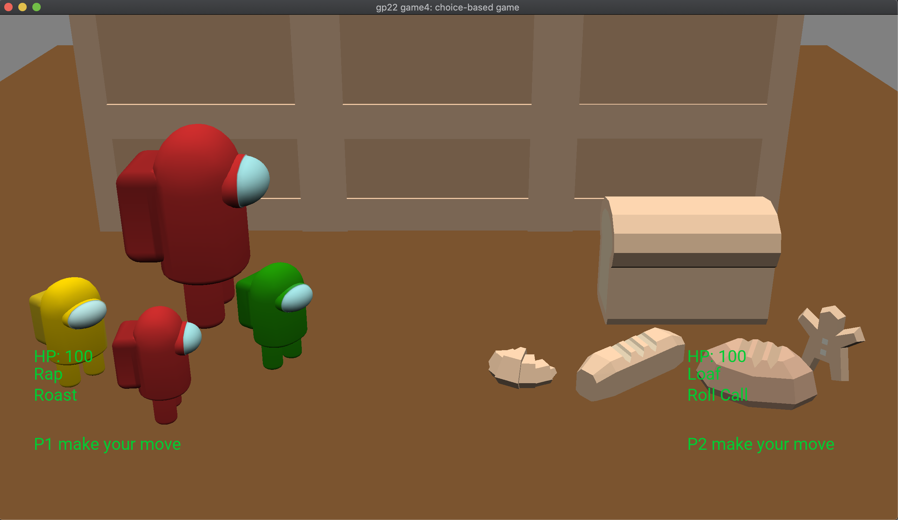

# But Words Will Never Hurt me

Authors: Dakota Hernandez (dshernan), Denise Yang (denisey)

Design: Our game is a JRPG-style turn-based game. Players attack each other with words, because words can be hurtful!

Our "extra thing" is adding voice effects that correspond to the different choices the player makes! We wanted to have more in-depth voices for specific scnearios, but we ran out of time.

Text Drawing: Our game stores glyphs for the standard ASCII character set while the PlayMode constructor is running. When a string needs to be drawn, we iterate through the characters in the string at runtime and render the glyph texture. We wanted to implement text shaping with Harfbuzz but we ran out of time.

Choices: The game keeps track of each player's move choices and health. In the game's "Deciding" phase, each player selects a move. After selecting, the players deal damage to each other. There is variance in damage dealth, move accuracy, and critical hit chance that can take the battle in many different directions. Hence, each battle is unique.

Screen Shot:

How To Play:

Player 1:

- Rap: a
- Roast: s

Player 2:

- Loaf: j
- Roll Call: k

Sources:

Models: 

- https://kenney.nl/assets/fantasy-town-kit
- https://kenney.nl/assets/food-kit

Sounds: 

- ourselves ;)

Text Rendering Code: https://learnopengl.com/In-Practice/Text-Rendering

This game was built with [NEST](NEST.md).

